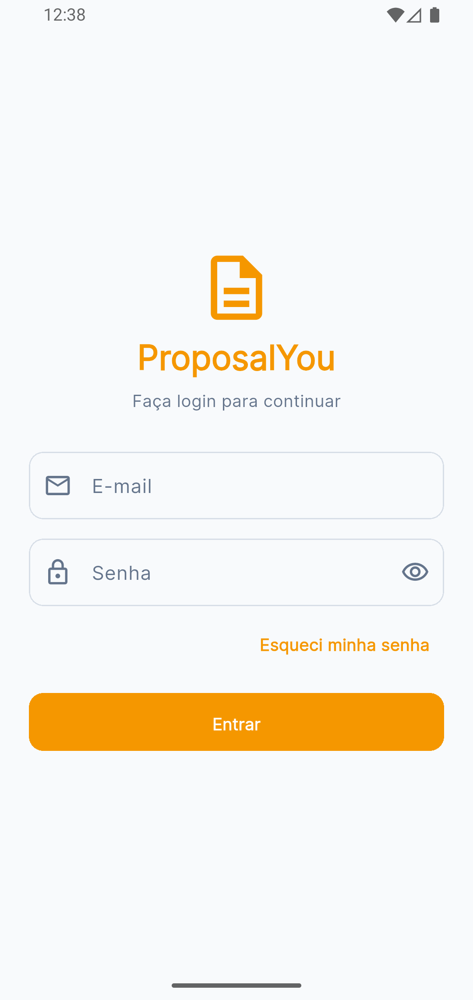
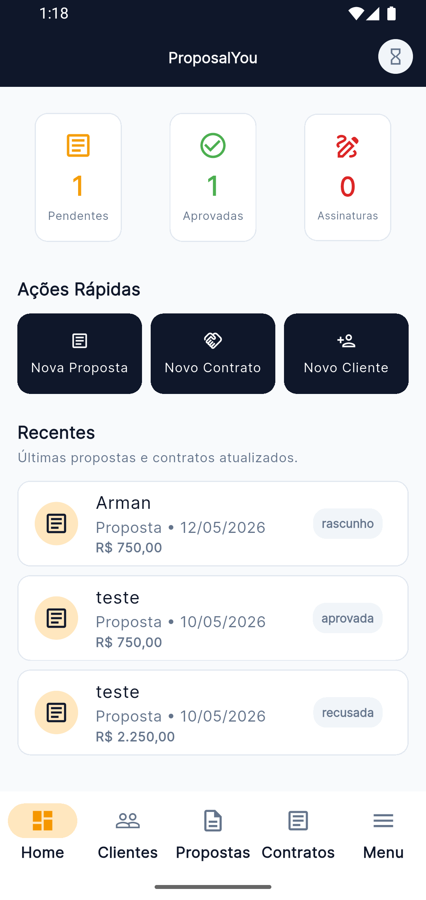
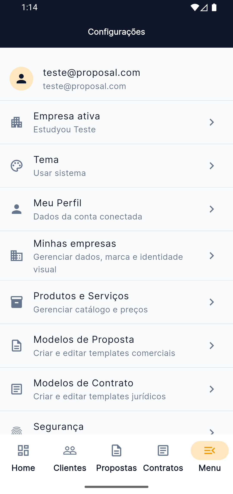

<div align="center">

# ProposalYou

[](https://flutter.dev/)
[](https://dart.dev/)
[](https://supabase.com/)
[](https://riverpod.dev/)
[](https://pub.dev/packages/go_router)

**IFRO - Programação Mobile II**  
**Atividade Prática Avaliativa - Meu Primeiro Aplicativo na Loja de Apps**

</div>

---

## 1. Descrição

O **ProposalYou** é um aplicativo mobile desenvolvido em **Flutter** para auxiliar pequenos negócios e prestadores de serviço na criação, organização e formalização de **propostas comerciais**, **contratos** e **assinaturas** de maneira simples.

A proposta do app é reduzir a informalidade em negociações do dia a dia, oferecendo uma solução digital leve para registrar acordos, organizar informações de clientes e acompanhar documentos importantes em um só lugar.

---

## 2. Motivação

Em muitos negócios locais, especialmente entre pequenos empreendedores e prestadores de serviço, ainda é comum que acordos sejam feitos apenas na conversa, sem qualquer registro formal. Isso pode gerar insegurança para ambas as partes: de um lado, quem presta o serviço corre o risco de sofrer calotes ou não conseguir comprovar o que foi combinado; do outro, quem assina um contrato muitas vezes aceita termos injustos por falta de clareza ou organização.

O **ProposalYou** nasceu da ideia de oferecer uma forma mais simples, acessível e prática de formalizar essas relações. O objetivo é ajudar empreendedores com menor maturidade digital a transformar propostas e contratos em algo mais compreensível, organizado e seguro, sem complicar o processo.

---

## 3. Público-Alvo

Este aplicativo foi pensado principalmente para:

- pequenos empresários;
- autônomos e prestadores de serviço;
- microempreendedores que precisam formalizar acordos com clientes;
- negócios locais que ainda trabalham de forma muito informal;
- usuários que precisam de uma solução simples para organizar propostas, contratos e assinaturas.

---

## 4. Problema que o aplicativo resolve

O app busca resolver a dificuldade de **formalizar negociações comerciais de maneira simples**, especialmente em contextos onde ainda existe pouca organização digital.

Com ele, o usuário pode:

- cadastrar clientes;
- organizar produtos e serviços;
- gerar propostas comerciais;
- transformar propostas em contratos;
- acompanhar o status dos documentos;
- centralizar informações importantes em um fluxo mais seguro e profissional.

---

## 5. Requisitos Atendidos

| # | Requisito da atividade | Como o projeto atende |
|---|---|---|
| 1 | Aplicação com tema livre e finalidade clara | O app resolve a formalização de propostas e contratos para pequenos negócios |
| 2 | Aplicação funcional com fluxo principal completo | Possui autenticação, dashboard, clientes, propostas, contratos e navegação entre telas |
| 3 | Arquitetura organizada | Estrutura em camadas e por features, com separação entre apresentação, domínio, dados e serviços |
| 4 | Integração com backend | Utiliza **Supabase** para autenticação e persistência remota |
| 5 | Gerenciamento de estados | Utiliza **Riverpod** em partes centrais do aplicativo |
| 6 | README.md completo | Este documento apresenta descrição, arquitetura, backend, estado, execução e uso de IA |
| 7 | Código versionado no GitHub | Projeto preparado para entrega em repositório versionado |
| 8 | Uso de IA com Antigravity | A IA foi utilizada como apoio em organização, revisão, correções e documentação |

---

## 6. Tecnologias Utilizadas

### Principais tecnologias

- **Flutter** — desenvolvimento da interface mobile
- **Dart** — linguagem principal do projeto
- **Supabase** — autenticação, banco de dados e serviços de backend
- **Riverpod** — gerenciamento de estados
- **GoRouter** — navegação e controle de rotas
- **Drift** — persistência local e cache offline

### Bibliotecas complementares

- `flutter_secure_storage` — armazenamento seguro de dados sensíveis
- `local_auth` — autenticação biométrica
- `shared_preferences` — preferências locais
- `pdf` e `printing` — geração e exportação de documentos
- `flutter_pdfview` — visualização de PDF
- `share_plus` — compartilhamento de documentos e links
- `image_picker` — seleção de imagens
- `intl` — formatação de datas e valores monetários

---

## 7. Arquitetura

O projeto segue uma organização **modular por features**, combinando separação por responsabilidades com uma estrutura em camadas.

### Estrutura geral

```text
lib/
├── core/
│   ├── router/
│   └── services/
├── data/
│   ├── drift/
│   ├── dtos/
│   └── repositories/
├── features/
│   ├── auth/
│   ├── clients/
│   ├── contracts/
│   ├── contract_templates/
│   ├── home/
│   ├── products/
│   ├── proposals/
│   ├── proposal_templates/
│   ├── providers/
│   └── settings/
└── shared/
    ├── theme/
    └── widgets/
```

### Organização das responsabilidades

- **presentation/**: telas, formulários e widgets de interface
- **domain/**: estado da feature e regras de interação da interface com os dados
- **repositories/**: comunicação com backend e persistência
- **core/services/**: serviços centrais, como autenticação e contexto da empresa ativa
- **drift/**: cache local e suporte ao funcionamento com persistência offline

Essa estrutura foi escolhida para facilitar manutenção, escalabilidade e clareza na explicação do projeto.

---

## 8. Funcionalidades Principais

O aplicativo possui as seguintes funcionalidades centrais:

- onboarding e autenticação de usuário;
- dashboard com visão geral de propostas e contratos;
- gerenciamento de clientes;
- gerenciamento de produtos e serviços;
- criação de propostas em múltiplas etapas;
- geração de contratos a partir do fluxo comercial;
- visualização e compartilhamento de documentos;
- gerenciamento de templates de proposta e contrato;
- troca de empresa ativa dentro do sistema;
- suporte a cache local para melhorar a experiência de uso.

---

## 9. Fluxo Principal da Aplicação

O fluxo principal pensado para a atividade é:

1. **Splash / Onboarding**  
   O usuário entra no app e visualiza a apresentação inicial.

2. **Login**  
   O acesso é realizado com autenticação integrada ao backend.

3. **Home / Dashboard**  
   O sistema apresenta métricas, itens recentes e atalhos para os módulos principais.

4. **Seleção da empresa ativa**  
   O usuário define em qual contexto empresarial deseja trabalhar.

5. **Cadastro e gestão de clientes**  
   O app permite registrar e editar clientes.

6. **Criação de proposta**  
   O fluxo de proposta acontece em etapas, com seleção de cliente, dados e itens.

7. **Geração de contrato**  
   O contrato dá continuidade ao processo comercial e à formalização do acordo.

8. **Consulta de detalhes e acompanhamento**  
   O usuário pode visualizar documentos gerados e acompanhar seu status.

Esse fluxo atende ao requisito de possuir **telas navegáveis** e **uma funcionalidade principal completa**.

---

## 10. Backend

O backend utilizado no projeto é o **Supabase**.

### Como ele é usado no app

- autenticação de usuários;
- armazenamento e leitura de dados persistentes;
- sincronização de informações do sistema;
- suporte às operações centrais de propostas, contratos, clientes e demais cadastros.

Além da comunicação com o Supabase, o projeto utiliza **Drift** como camada de persistência local para cache e melhoria da experiência offline/reativa.

---

## 11. Gerenciamento de Estados

O gerenciador de estados adotado é o **Riverpod**.

### Onde ele é utilizado

O Riverpod é aplicado em áreas importantes do sistema, como:

- autenticação;
- dashboard inicial;
- listas e detalhes de clientes;
- listas e fluxo de produtos;
- listas e fluxo de propostas;
- listas e fluxo de contratos;
- configurações e contexto de empresa ativa.

### Por que ele foi escolhido

O Riverpod permite:

- separar melhor a lógica da interface;
- manter a aplicação reativa;
- atualizar telas com mais segurança;
- organizar o controle de estado em diferentes módulos do app.

Isso atende ao requisito da atividade de demonstrar claramente **onde o estado é controlado**, **quais dados mudam** e **por que o gerenciador foi utilizado**.

---

## 12. Tratamento de Estados da Interface

O app contempla tratamento básico de estados exigidos pela atividade, incluindo:

- **loading** em carregamentos assíncronos;
- **erro** quando ocorre falha em autenticação ou carregamento;
- **estado vazio** quando não há dados cadastrados;
- **feedback visual** em ações de salvar, carregar e navegar.

Esses tratamentos reforçam a usabilidade e ajudam a tornar o fluxo mais compreensível para o usuário.

---

## 13. Uso de IA com Antigravity

Durante o desenvolvimento, a IA foi utilizada como **ferramenta de apoio**, especialmente em:

- organização de partes da arquitetura;
- revisão de fluxo e navegação;
- correção de erros;
- ajustes de estrutura de código;
- apoio na documentação do projeto;
- melhoria da clareza do README.

A IA foi usada para acelerar etapas técnicas e apoiar decisões, mas a compreensão do código, os ajustes finais e a responsabilidade pelo resultado do projeto permaneceram sob controle do aluno.

---

## 14. Como Executar o Projeto

### Pré-requisitos

Antes de executar, é recomendado ter instalado:

- Flutter SDK
- Dart SDK
- Android Studio ou VS Code com suporte Flutter
- dispositivo físico, emulador Android ou ambiente desktop compatível

### Passos básicos

```bash
git clone [<url-do-repositorio>](https://github.com/ArmandoGT/estudyou-proposalyou.git)
cd proposalyou
flutter pub get
flutter run
```

### Execução com configuração do Supabase

O projeto pode utilizar variáveis injetadas via `--dart-define`:

```bash
flutter run --dart-define=SUPABASE_URL=SEU_SUPABASE_URL --dart-define=SUPABASE_ANON_KEY=SUA_SUPABASE_ANON_KEY
```

### Comandos úteis de validação

```bash
flutter analyze
flutter test
```

### Observação

Se houver necessidade de regenerar arquivos gerados, pode ser usado:

```bash
dart run build_runner build --delete-conflicting-outputs
```

---

## 15. Prints da Aplicação

### Capturas de Tela

<table>
  <tr>
    <td align="center"><strong>Tela de Login</strong></td>
    <td align="center"><strong>Home / Dashboard</strong></td>
    <td align="center"><strong>Configurações</strong></td>
  </tr>
  <tr>
    <td align="center"></td>
    <td align="center"></td>
    <td align="center"></td>
  </tr>
</table>

> **Figura 1:** Interface de autenticação da aplicação, responsável pelo acesso inicial do usuário ao sistema.

> **Figura 2:** Tela principal da aplicação, apresentando indicadores resumidos e atalhos de navegação para as funcionalidades centrais do sistema.

> **Figura 3:** Tela de configurações da aplicação, contendo opções de gerenciamento da empresa ativa e acesso às áreas administrativas.

> **Plataforma testada:** Android (Emulador: Pixel 4 API 36.0)

---

## 16. Autor

**ArmandoGT**  
Projeto desenvolvido para a disciplina de **Programação Mobile II** no **IFRO**.

---

## 17. Resultado Esperado da Entrega

Com este projeto, a proposta é demonstrar uma aplicação mobile com:

- finalidade clara;
- fluxo principal funcional;
- arquitetura organizada;
- integração com backend real;
- gerenciamento de estados aplicado em partes relevantes;
- documentação suficiente para apresentação e avaliação.

O **ProposalYou** foi estruturado para atender aos requisitos da atividade avaliativa e servir como base para evolução futura, incluindo empacotamento e publicação.
